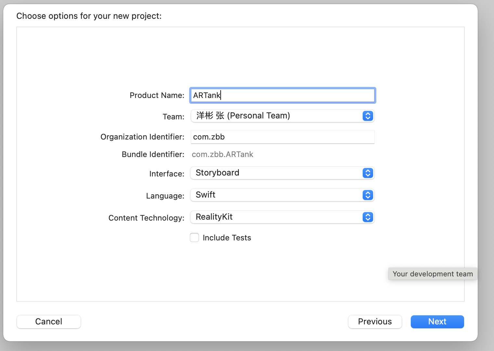
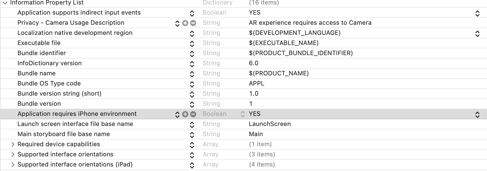
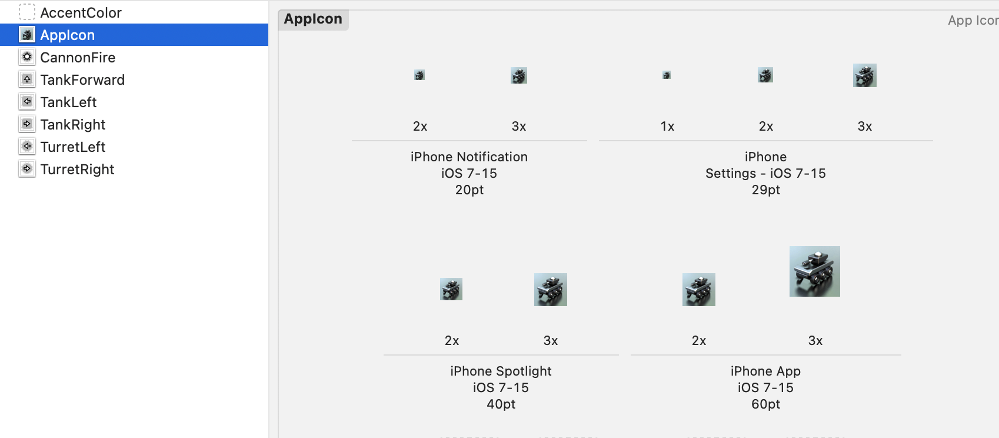
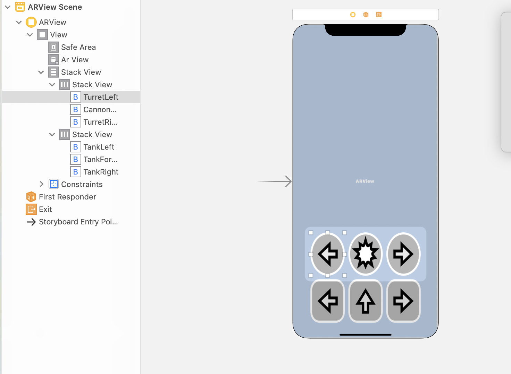

# Iw09

> @StuID:191220169
>
> @Name:张洋彬 

## iOS assignment 9: ARKit之坦克构造

### 1. 实验任务

#### 1.1 任务介绍

​		创建Augmented Reality App，利用提供的素材将坦克显示在真实世界中（通过摄像头），并实现坦克的前进、左转、右转，炮台的左转、右转、开火功能按钮，可供用户操作。


### 2. 实验过程

#### 2.1 创建一个AR app

​	new -> project创建了一个Augmented Reality App



#### 2.2 配置info.plist

​	需要通过配置info.plist获得摄像头的授权




#### 2.3 将坦克显示在屏幕中

​	将TinyToyTank.rcproject拖入xcode工程

```swift
 var tankAnchor: TinyToyTank._TinyToyTank?
 override func viewDidLoad() {
        super.viewDidLoad()
        tankAnchor = try! TinyToyTank.load_TinyToyTank()
        arView.scene.anchors.append(tankAnchor!)
 }
```

​	修改viewDidLoad函数，使得坦克能在屏幕上显示

#### 2.4 添加按钮

​	将按钮的图片资源加入Assets库，APP的图标加入AppIcon



​	添加六个按钮，并对六个按钮连接函数，三个按钮成为一个Horizontal Stack View，两个StackView连成一个vertical Stack View。




> 使用background image来添加按钮的image


#### 2.5 事件函数

​	6个函数都如下所示：

```swift
@IBAction func TurretRightPressed(_ sender: Any) {
        tankAnchor!.notifications.turretRight.post()
    }
```


#### 2.6 添加炮对塔的依赖以及防止并发操作

```swift
  var isActionPlaying: Bool = false 
    override func viewDidLoad() {
        super.viewDidLoad()
        tankAnchor = try! TinyToyTank.load_TinyToyTank()
        tankAnchor!.turret?.setParent(tankAnchor!.tank, preservingWorldTransform: true)
        tankAnchor?.actions.actionComplete.onAction = { _ in
          self.isActionPlaying = false
        }
        arView.scene.anchors.append(tankAnchor!)
    }

@IBAction func TankForwardPressed(_ sender: Any) {
        if self.isActionPlaying {
            return
        }else {
            self.isActionPlaying = true
        }
        tankAnchor!.notifications.tankForward.post()
    }
```


### 3. 实验心得

​		这次实验是按照老师提供的ppt一点一点完成的，主要是体会AR和Reality Composer。总体来说是体会过程，在完成后对整体框架的理解加深了。

